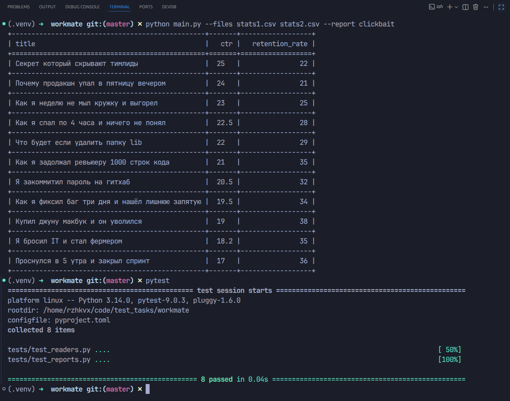

# Тестовое задание

Тестовое задание на позицию Python-разработчик в команду Workmate.

## Запуск утилиты

Утилита запускается через файл `main.py`:

## Требования

Полное техническое задание находится в файле:

[ТЗ.pdf](ТЗ.pdf)
